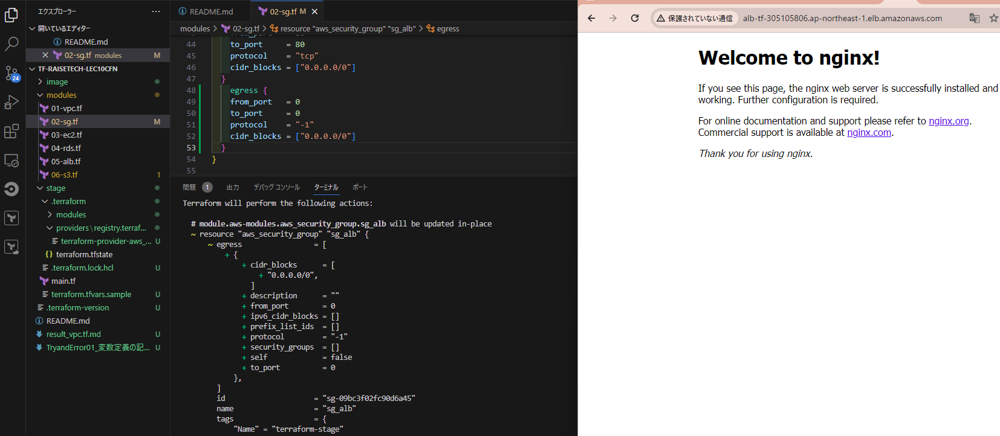

# CloudFormationで構築した環境をTerraformで構築する
## 方針
* Modules機能をつかって構築することにしました。
* 環境ごとの差異が多い場合などに活用するそうですが、直感的にわかりやすいなと思ったのでworkspace機能ではなくこちらにしました。
* 各リソースがモジュールとして分離されているので、疎結合を保ったまま構築ができ、たとえば実際の開発現場で、モジュールごとに開発することがあれば便利かと思います。
* 今回作成するインフラストラクチャは[こちらの構成図（VPC,EC2,RDS,ALB,S3）](https://github.com/kawasaki8108/RaiseTech/blob/main/image_05/RiaseTech-lecture05%E6%A7%8B%E6%88%90%E5%9B%B3.png)です
* DynamoDB を使って、排他ロック（先に操作した人が終わるまで apply などをブロックする）をかけるという方法もありますが今回は割愛します。
  * https://www.terraform.io/docs/backends/types/s3.html#dynamodb-state-locking
* 今回作成するフォルダ構成は次の通りです。

## フォルダ構成
* .terraformフォルダ以下はstageディレクトリで`terraform init`で自動で生成されます
* terraform.tfvarsファイル使わなくてもmain.tfに変数定義を記述してもいいのですが、今回はtfvarsの使い方を理解するために使用しました。
```bash
\---tf-raisetech-lec10cfn
    |   .terraform-version        #バージョン指定
    |
    +---modules
    |       01-vpc.tf
    |       02-sg.tf
    |       03-ec2.tf
    |       04-rds.tf
    |       05-alb.tf
    |       06-s3.tf
    |       variables.tf          #modules下のリソースファイル.tfで使う変数の中身を記述する
    |
    \---stage
        |   .terraform.lock.hcl   #`terraform init`で自動で生成される
        |   main.tf               #中身：provider,terraform,baskend,modulesのブロック＋各moduleで使う変数の中身を"stage環境としては”で記述する
        |   terraform.tfvars      #stageディレクトリ下での変数定義を入れる
        |   variables.tf          #stageディレクトリ下での変数名を設定する
        |
        \---.terraform            #これ以下は`terraform init`で自動で生成される
            |   terraform.tfstate
            |
            +---modules
            |       modules.json
            |
            \---providers
                \---registry.terraform.io
                    \---hashicorp
                        \---aws
                            \---3.76.1
                                \---windows_amd64
                                        terraform-provider-aws_v3.76.1_x5.exe

```
## フォルダと空ファイルを用意

* ユーザー名のディレクトリの下に以下の通りディレクトリ作成(今後も別の要件で使うかもしれないのでフォルダ整理のために)
```bash
$ mkdir ~/TerraformPJ/
```
* 「TerraformPJ」の下に各種PJをフォルダわけしようと思います
* 今回のテストランはGithubにあげようと思うので、先にGitHubでリモートリポジトリを作成してローカルにgit cloneすることろからやりました
```bash
$ git clone https://github.com/username/tf-raisetech-lec10cfn.git
$ cd tf-raisetech-lec10cfn
$ mkdir modules && cd $_
$ touch aws-vpc.tf aws-sg.tf aws-ec2.tf aws-rds.tf aws-alb.tf aws-s3.tf variables.tf
$ mkdir ../stage
$ cd ../stage
$ touch main.tf variables.tf terraform.tfvars
$ cd ../
$ pwd
/c/Users/username/TerraformPJ/tf-raisetech-lec10cfn
$ tfenv pin #当該ディレクトリではこのバージョンで使うことを指定
Pinned version by writing "1.6.6" to /c/Users/username/TerraformPJ/tf-raisetech-lec10cfn/.terraform-version
$ ls -al | grep .terra
$ cat .terraform-version
1.6.6
$ cd ../
$ pwd
/c/Users/username/TerraformPJ
$ tree      #上述のフォルダ構成になっているはず
```

## Backend機能を使う
先に以下のコマンドでS3バケットを生成しておく
```bash
$ aws s3 mb s3://tf-raisetech-lec10cfn
make_bucket: tf-raisetech-lec10cfn
```
backendの定義をmain.tfに追記する
```bash
# backendの定義
terraform {
  backend "s3" {
    bucket = "tf-raisetech-lec10cfn"
    key = "tf-raisetech-lec10cfn/stage/terraform.tfstate"
    region = "ap-northeast-1"
  }
}
```
## 各moduleを作成
stageのディレクトリで`terraform init`してから以下の順に操作
```bash
$ terraform fmt
$ terraform validate    #計10回はトライアンドエラーしていました。。
$ terraform apply
```
いろいろ参考にして実装しました。ほとんどリファレンスですが、よろしければ「参考」を展開ください。

<details><summary>参考</summary>

### main.tfを編集
#### module構成の参考記事
他にも多くの記事をみましたが、構成のこともわかるし、それにともなう変数の使い方もわかりやすかったものをピックアップして以下にメモします。
* https://dev.classmethod.jp/articles/directory-layout-bestpractice-in-terraform/
* https://qiita.com/reireias/items/253529c889cafb3fa4c7


### vpc.tfを編集
#### 参考記事
* [【Terraform入門】AWSのVPCとEC2を構築してみる](https://kacfg.com/terraform-vpc-ec2/)
* 公式doc
  * https://kacfg.com/terraform-vpc-ec2/
  * https://registry.terraform.io/providers/hashicorp/aws/latest/docs/resources/subnet
  * https://registry.terraform.io/providers/hashicorp/aws/latest/docs/resources/internet_gateway
  * https://registry.terraform.io/providers/hashicorp/aws/latest/docs/resources/internet_gateway_attachment
  * 
  * https://registry.terraform.io/providers/hashicorp/aws/latest/docs/resources/route_table
    * Routeととしてのresource記載は不要で、RouteTableのresource内部にrouteの内容を記述できる
  * https://registry.terraform.io/providers/hashicorp/aws/latest/docs/resources/route_table_association

### sg.tfを編集
#### 参考記事
* https://dev.classmethod.jp/articles/terraform-security-group/
* https://beyondjapan.com/blog/2022/10/terraform-how-to-use-security-group/
* 公式
  * https://registry.terraform.io/providers/hashicorp/aws/latest/docs/resources/security_group
  * https://registry.terraform.io/providers/hashicorp/aws/latest/docs/resources/security_group_rule
    * 特にRDS用のセキュリティグループのインバウンドルールにおけるソースをEC2用のセキュリティグループIDにするという方法の参照として使いました。↓の参考記事も同様です。
* https://ohshige.hatenablog.com/entry/2019/11/11/190000
* https://qiita.com/suzuki0430/items/2dbd88dfb5ed53016914

### ec2.tfを編集
#### 参考記事
* https://zenn.dev/supersatton/articles/c87853cc5a3dbd
* https://qiita.com/okdyy75/items/73641a0247bae1fa7f31
* https://khasegawa.hatenablog.com/entry/2017/10/03/000000
* [[Terraform][CloudFormation]最新のAMI IDの取得方法](https://qiita.com/to-fmak/items/7623ee6e15249a4bcedd#:~:text=%E3%80%8CData%20Source%E3%80%8D%E3%81%A7%E6%9C%80%E6%96%B0%E3%81%AE,AMI%E3%82%92%E5%8F%96%E5%BE%97%E3%81%A7%E3%81%8D%E3%81%BE%E3%81%99%E3%80%82)
* 公式
  * https://registry.terraform.io/providers/hashicorp/aws/latest/docs/data-sources/instance

### rds.tfを編集
#### 参考記事
* https://zenn.dev/suganuma/articles/fe14451aeda28f
* https://tech.isid.co.jp/entry/terraform_manage_master_user_password
* https://zenn.dev/yumemi_inc/articles/081b0190db8260
* 公式
  * https://registry.terraform.io/providers/hashicorp/aws/latest/docs/resources/db_subnet_group
  * https://registry.terraform.io/providers/hashicorp/aws/latest/docs/data-sources/ssm_parameter
  * https://registry.terraform.io/providers/hashicorp/aws/latest/docs/resources/db_instance

### alb.tfとs3.tfを編集
#### 参考記事
* https://katsuya-place.com/terraform-elb-basic/
* https://cloud5.jp/terraform-alb/
* https://y-ohgi.com/introduction-terraform/handson/alb/
* 公式
  * https://registry.terraform.io/providers/hashicorp/aws/latest/docs/resources/lb
  * https://www.terraform.io/docs/providers/aws/r/lb_listener.html
  * https://registry.terraform.io/providers/hashicorp/aws/latest/docs/resources/s3_bucket

</details>

## 結果
* 結果の簡易的に確認しました。確認手順は以下の通りです。
  * EC2へのSSH接続
  * EC2からRDS(mysql)への接続
  * EC2で起動するNginxのwelcomeページ(200ok状態)をALBのDNSをたたいて確認
<details><summary>詳細な結果確認の手順</summary>

#### インフラストラクチャ作成
```bash
$ sudo yum update
$ sudo yum install mysql
$ mysql -u admin -p -h ★RDSのエンドポイント★
#Parameter Storeに保管しているパスワードを入力
Welcome to the MariaDB monitor.  Commands end with ; or \g.
Your MySQL connection id is 21
Server version: 8.0.33 Source distribution

Copyright (c) 2000, 2018, Oracle, MariaDB Corporation Ab and others.

Type 'help;' or '\h' for help. Type '\c' to clear the current input statement.

MySQL [(none)]> exit
Bye
$ amazon-linux-extras list | grep nginx
$ sudo amazon-linux-extras install nginx1
$ nginx -v
nginx version: nginx/1.22.1
$ sudo systemctl start nginx
$ sudo systemctl status nginx
$ sudo systemctl enable nginx
$ systemctl is-enabled nginx
$ curl http://alb-tf-625564651.ap-northeast-1.elb.amazonaws.com/
<!DOCTYPE html>
<html>
<head>
<title>Welcome to nginx!</title>
<style>
html { color-scheme: light dark; }
body { width: 35em; margin: 0 auto;
font-family: Tahoma, Verdana, Arial, sans-serif; }
</style>
</head>
<body>
<h1>Welcome to nginx!</h1>
<p>If you see this page, the nginx web server is successfully installed and
working. Further configuration is required.</p>

<p>For online documentation and support please refer to
<a href="http://nginx.org/">nginx.org</a>.<br/>
Commercial support is available at
<a href="http://nginx.com/">nginx.com</a>.</p>

<p><em>Thank you for using nginx.</em></p>
</body>
</html>
$ exit
```

#### インフラストラクチャ削除
##### リソース情報取得
* 今回Terraformで作ったリソースはtagを入れているので、tagがついたリソースを、AWS CLIで取得します
  * 公式）https://awscli.amazonaws.com/v2/documentation/api/latest/reference/resourcegroupstaggingapi/get-resources.html
* 公式docによると、VPCの削除までは以下の順序で操作が必要だそうです
>1. セキュリティグループ
>2. 各ネットワーク ACL
>3. 各サブネット
>4. 各カスタムルートテーブル
>5. インターネットゲートウェイを VPC からデタッチ
>6. インターネットゲートウェイを削除
>7. エグレス専用インターネットゲートウェイ
>8. VPC を削除
* 上記以外にも先にインスタンス（今回はEC2とRDS）を削除しないといけなくてインスタンスのID系が必要なのでいったんこのとおりリソース情報を取得します

まずはリソースの情報取得
https://docs.aws.amazon.com/cli/latest/reference/resourcegroupstaggingapi/get-resources.html
```bash
$ aws resourcegroupstaggingapi get-resources --no-paginate --region ap-northeast-1 \
--tag-filters Key=Name,\
Values=20240105-terraform-stage,20240105-terraform-stage-public-1a-sn,20240105-terraform-stage-public-1c-sn
```
取得した値は以下の感じになります（抜粋）
```json
        {
            "ResourceARN": "arn:aws:ec2:ap-northeast-1:************:route-table/rtb-0b42571d2f38c6100",
            "Tags": [
                {
                    "Key": "Name",
                    "Value": "20240105-terraform-stage"
                }
            ]
        },
        {
            "ResourceARN": "arn:aws:ec2:ap-northeast-1:************:security-group/sg-0a623d83ccb77cd23",
            "Tags": [
                {
                    "Key": "Name",
                    "Value": "20240105-terraform-stage"
                }
            ]
        },

```
ちなみに取得した全文は以下の通りです。
<details><summary>取得した全文</summary>

```json
{
    "PaginationToken": "",
    "ResourceTagMappingList": [
        {
            "ResourceARN": "arn:aws:ec2:ap-northeast-1:************:security-group/sg-00dbf655578e404fc",
            "Tags": [
                {
                    "Key": "Name",
                    "Value": "20240105-terraform-stage"
                }
            ]
        },
        {
            "ResourceARN": "arn:aws:ec2:ap-northeast-1:************:security-group/sg-09a9d28b411280136",
            "Tags": [
                {
                    "Key": "Name",
                    "Value": "20240105-terraform-stage"
                }
            ]
        },
        {
            "ResourceARN": "arn:aws:ec2:ap-northeast-1:************:subnet/subnet-0fcfa00a888e5b156",
            "Tags": [
                {
                    "Key": "Name",
                    "Value": "20240105-terraform-stage-public-1c-sn"
                }
            ]
        },
        {
            "ResourceARN": "arn:aws:elasticloadbalancing:ap-northeast-1:************:loadbalancer/app/alb-tf/036cf7d537523dd9",
            "Tags": [
                {
                    "Key": "Name",
                    "Value": "20240105-terraform-stage"
                }
            ]
        },
        {
            "ResourceARN": "arn:aws:ec2:ap-northeast-1:************:route-table/rtb-0b42571d2f38c6100",
            "Tags": [
                {
                    "Key": "Name",
                    "Value": "20240105-terraform-stage"
                }
            ]
        },
        {
            "ResourceARN": "arn:aws:ec2:ap-northeast-1:************:security-group/sg-0a623d83ccb77cd23",
            "Tags": [
                {
                    "Key": "Name",
                    "Value": "20240105-terraform-stage"
                }
            ]
        },
        {
            "ResourceARN": "arn:aws:rds:ap-northeast-1:************:db:terraform-20240105055854660100000002",
            "Tags": [
                {
                    "Key": "Name",
                    "Value": "20240105-terraform-stage"
                }
            ]
        },
        {
            "ResourceARN": "arn:aws:ec2:ap-northeast-1:************:internet-gateway/igw-08aa4966f8bd8df02",
            "Tags": [
                {
                    "Key": "Name",
                    "Value": "20240105-terraform-stage"
                }
            ]
        },
        {
            "ResourceARN": "arn:aws:ec2:ap-northeast-1:************:vpc/vpc-0b2521d9a5e690b70",
            "Tags": [
                {
                    "Key": "Name",
                    "Value": "20240105-terraform-stage"
                }
            ]
        },
        {
            "ResourceARN": "arn:aws:rds:ap-northeast-1:************:subgrp:dbsng_tf",
            "Tags": [
                {
                    "Key": "Name",
                    "Value": "20240105-terraform-stage"
                }
            ]
        },
        {
            "ResourceARN": "arn:aws:ec2:ap-northeast-1:************:instance/i-0791f5b3652cd1e1e",
            "Tags": [
                {
                    "Key": "Name",
                    "Value": "20240105-terraform-stage"
                }
            ]
        },
        {
            "ResourceARN": "arn:aws:ec2:ap-northeast-1:************:subnet/subnet-0f2369a2d1a1824c8",
            "Tags": [
                {
                    "Key": "Name",
                    "Value": "20240105-terraform-stage-public-1a-sn"
                }
            ]
        }
    ]
}

```
</details>

##### ALBのアクセスログをオフにする
ALBのアクセスログがS3バケットにどんどんたまっていくので、ログの蓄積をまず解除します
https://docs.aws.amazon.com/cli/latest/reference/elbv2/modify-load-balancer-attributes.html
```bash
aws elbv2 modify-load-balancer-attributes --load-balancer-arn arn:aws:elasticloadbalancing:ap-northeast-1:************:loadbalancer/app/alb-tf/036cf7d537523dd9 --attributes Key=access_logs.s3.enabled,Value=false
```
※「**********」は伏せているだけです
以下のように返され、マネジメントコンソールでもアクセスログがオフになっていることがわかります。ALBの「属性」情報で他のパラメータも含めて返されてきますね。
```json
{
    "Attributes": [
        {
            "Key": "access_logs.s3.enabled",
            "Value": "false"  //オフになっています
        },
        {
            "Key": "access_logs.s3.bucket",
            "Value": "s3-alb-log240104tf"
        },
        {
            "Key": "access_logs.s3.prefix",
            "Value": ""
        },
        {
            "Key": "idle_timeout.timeout_seconds",
            "Value": "60"
        },
        {
            "Key": "deletion_protection.enabled",
            "Value": "false"
        },
        {
            "Key": "routing.http2.enabled",
            "Value": "true"
        },
        {
            "Key": "routing.http.drop_invalid_header_fields.enabled",
            "Value": "false"
        },
        {
            "Key": "routing.http.xff_client_port.enabled",
            "Value": "false"
        },
        {
            "Key": "routing.http.preserve_host_header.enabled",
            "Value": "false"
        },
        {
            "Key": "routing.http.xff_header_processing.mode",
            "Value": "append"
        },
        {
            "Key": "load_balancing.cross_zone.enabled",
            "Value": "true"
        },
        {
            "Key": "routing.http.desync_mitigation_mode",
            "Value": "defensive"
        },
        {
            "Key": "waf.fail_open.enabled",
            "Value": "false"
        },
        {
            "Key": "routing.http.x_amzn_tls_version_and_cipher_suite.enabled",
            "Value": "false"
        },
        {
            "Key": "connection_logs.s3.enabled",
            "Value": "false"
        },
        {
            "Key": "connection_logs.s3.bucket",
            "Value": ""
        },
        {
            "Key": "connection_logs.s3.prefix",
            "Value": ""
        }
    ]
}
```


##### VPC内にあるEC2インスタンスを削除
* 公式）https://docs.aws.amazon.com/cli/latest/reference/ec2/terminate-instances.html
* https://blog.serverworks.co.jp/2020/01/10/000000
```bash
$ aws ec2 terminate-instances --instance-ids i-0791f5b3652cd1e1e
#以下の通り返される
{
    "TerminatingInstances": [
        {
            "CurrentState": {
                "Code": 32,
                "Name": "shutting-down"
            },
            "InstanceId": "i-0791f5b3652cd1e1e",
            "PreviousState": {
                "Code": 16,
                "Name": "running"
            }
        }
    ]
}
```

##### VPC内にあるRDSインスタンスを削除
公式）https://docs.aws.amazon.com/ja_jp/AmazonRDS/latest/UserGuide/USER_DeleteInstance.html
https://qiita.com/tcsh/items/d7ca66fe8251f865c668
```bash
aws rds delete-db-instance \
    --db-instance-identifier terraform-20240105055854660100000002 \
    --skip-final-snapshot \
    --delete-automated-backups
#以下の通り返される
{
    "DBInstance": {
        "DBInstanceIdentifier": "terraform-20240105055854660100000002",
        "DBInstanceClass": "db.t3.micro",
        "Engine": "mysql",
        "DBInstanceStatus": "deleting",
        "MasterUsername": "admin",
        "Endpoint": {
            "Address": "terraform-20240105055854660100000002.c7nzmtxyau6j.ap-northeast-1.rds.amazonaws.com",
            "Port": 3306,
            "HostedZoneId": "Z24O6O9L7SGTNB"
        },
        "AllocatedStorage": 10,
        "InstanceCreateTime": "2024-01-05T06:02:01.112Z",
        "PreferredBackupWindow": "15:01-15:31",
        "BackupRetentionPeriod": 0,
        "DBSecurityGroups": [],
        "VpcSecurityGroups": [
            {
                "VpcSecurityGroupId": "sg-00dbf655578e404fc",
                "Status": "active"
            }
        ],
        "DBParameterGroups": [
            {
                "DBParameterGroupName": "default.mysql8.0",
                "ParameterApplyStatus": "in-sync"
            }
        ],
        "AvailabilityZone": "ap-northeast-1c",
        "DBSubnetGroup": {
            "DBSubnetGroupName": "dbsng_tf",
            "DBSubnetGroupDescription": "Managed by Terraform",
            "VpcId": "vpc-0b2521d9a5e690b70",
            "SubnetGroupStatus": "Complete",
            "Subnets": [
                {
                    "SubnetIdentifier": "subnet-01f2b56b3b0e50b82",
                    "SubnetAvailabilityZone": {
                        "Name": "ap-northeast-1a"
                    },
                    "SubnetOutpost": {},
                    "SubnetStatus": "Active"
                },
                {
                    "SubnetIdentifier": "subnet-0f82d6778caf3a507",
                    "SubnetAvailabilityZone": {
                        "Name": "ap-northeast-1c"
                    },
                    "SubnetOutpost": {},
                    "SubnetStatus": "Active"
                }
            ]
        },
        "PreferredMaintenanceWindow": "thu:17:09-thu:17:39",
        "PendingModifiedValues": {},
        "MultiAZ": false,
        "EngineVersion": "8.0.33",
        "AutoMinorVersionUpgrade": true,
        "ReadReplicaDBInstanceIdentifiers": [],
        "LicenseModel": "general-public-license",
        "OptionGroupMemberships": [
            {
                "OptionGroupName": "default:mysql-8-0",
                "Status": "in-sync"
            }
        ],
        "PubliclyAccessible": false,
        "StorageType": "gp2",
        "DbInstancePort": 0,
        "StorageEncrypted": false,
        "DbiResourceId": "db-55UM2BIVUVOLVMKO4VIWSWDLSA",
        "CACertificateIdentifier": "",
        "DomainMemberships": [],
        "CopyTagsToSnapshot": false,
        "MonitoringInterval": 0,
        "DBInstanceArn": "arn:aws:rds:ap-northeast-1:************:db:terraform-20240105055854660100000002",
        "IAMDatabaseAuthenticationEnabled": false,
        "PerformanceInsightsEnabled": false,
        "DeletionProtection": false,
        "AssociatedRoles": [],
        "TagList": [
            {
                "Key": "Name",
                "Value": "20240105-terraform-stage"
            }
        ],
        "CustomerOwnedIpEnabled": false,
        "BackupTarget": "region",
        "NetworkType": "IPV4",
        "StorageThroughput": 0,
        "DedicatedLogVolume": false
    }
}
```

##### ALBのアクセスログ用のS3バケット内を空にする
```bash
$ aws s3 rm s3://s3-alb-log240104tf --recursive
```

##### 一旦ここまでで`terraform destroy`
* 私の場合はここでTerraformで作ったリソースはすべて削除できました
* おそらくですが、ALBの削除保護解除が効いていたかと思います
* また、以下のTerraformからのメッセージを見ると、公式docにあるVPC削除の流れと似ていますので、依存関係が順序良く外れたのかなと思います
```
module.aws-modules.aws_route_table_association.public1c_rt_associate: Destroying... [id=rtbassoc-02f558ec0b0d6e382]
module.aws-modules.aws_s3_bucket_public_access_block.s3-alb-log-access: Destroying... [id=s3-alb-log240104tf]
module.aws-modules.aws_route_table_association.public1a_rt_associate: Destroying... [id=rtbassoc-08bab4b863cf28ea8]
module.aws-modules.aws_s3_bucket_policy.s3-alb-log-bucket-policy: Destroying... [id=s3-alb-log240104tf]
module.aws-modules.aws_security_group_rule.sg_rds_ingress: Destroying... [id=sgrule-2480648643]
module.aws-modules.aws_db_subnet_group.dbsng_tf: Destroying... [id=dbsng_tf]
module.aws-modules.aws_lb_listener.alb-listener_tf: Destroying... [id=arn:aws:elasticloadbalancing:ap-northeast-1:************:listener/app/alb-tf/036cf7d537523dd9/fe5f51316e2bab9d]
module.aws-modules.aws_db_subnet_group.dbsng_tf: Destruction complete after 0s
module.aws-modules.aws_subnet.private_1c_sn: Destroying... [id=subnet-0f82d6778caf3a507]
module.aws-modules.aws_subnet.private_1a_sn: Destroying... [id=subnet-01f2b56b3b0e50b82]
module.aws-modules.aws_lb_listener.alb-listener_tf: Destruction complete after 0s
module.aws-modules.aws_lb_target_group.alb-tg_tf: Destroying... [id=arn:aws:elasticloadbalancing:ap-northeast-1:************:targetgroup/alb-tg-tf/e007276deddc61bd]
module.aws-modules.aws_lb.alb_tf: Destroying... [id=arn:aws:elasticloadbalancing:ap-northeast-1:************:loadbalancer/app/alb-tf/036cf7d537523dd9]
module.aws-modules.aws_lb_target_group.alb-tg_tf: Destruction complete after 1s
module.aws-modules.aws_route_table_association.public1a_rt_associate: Destruction complete after 1s
module.aws-modules.aws_s3_bucket_public_access_block.s3-alb-log-access: Destruction complete after 1s
module.aws-modules.aws_route_table_association.public1c_rt_associate: Destruction complete after 1s
module.aws-modules.aws_route_table.public_rt: Destroying... [id=rtb-0b42571d2f38c6100]
module.aws-modules.aws_security_group_rule.sg_rds_ingress: Destruction complete after 1s
module.aws-modules.aws_security_group.sg_rds: Destroying... [id=sg-00dbf655578e404fc]
module.aws-modules.aws_security_group.sg_ec2: Destroying... [id=sg-0a623d83ccb77cd23]
module.aws-modules.aws_subnet.private_1a_sn: Destruction complete after 1s
module.aws-modules.aws_subnet.private_1c_sn: Destruction complete after 1s
module.aws-modules.aws_s3_bucket_policy.s3-alb-log-bucket-policy: Destruction complete after 1s
module.aws-modules.aws_security_group.sg_ec2: Destruction complete after 0s
module.aws-modules.aws_route_table.public_rt: Destruction complete after 0s
module.aws-modules.aws_internet_gateway.gw: Destroying... [id=igw-08aa4966f8bd8df02]
module.aws-modules.aws_security_group.sg_rds: Destruction complete after 0s
module.aws-modules.aws_lb.alb_tf: Destruction complete after 2s
module.aws-modules.aws_subnet.public_1c_sn: Destroying... [id=subnet-0fcfa00a888e5b156]
module.aws-modules.aws_subnet.public_1a_sn: Destroying... [id=subnet-0f2369a2d1a1824c8]
module.aws-modules.aws_security_group.sg_alb: Destroying... [id=sg-09a9d28b411280136]
module.aws-modules.aws_s3_bucket.s3-alb-log240104tf: Destroying... [id=s3-alb-log240104tf]
module.aws-modules.aws_s3_bucket.s3-alb-log240104tf: Destruction complete after 3s
module.aws-modules.aws_internet_gateway.gw: Destruction complete after 10s
module.aws-modules.aws_subnet.public_1c_sn: Still destroying... [id=subnet-0fcfa00a888e5b156, 10s elapsed]
module.aws-modules.aws_subnet.public_1a_sn: Still destroying... [id=subnet-0f2369a2d1a1824c8, 10s elapsed]
module.aws-modules.aws_security_group.sg_alb: Still destroying... [id=sg-09a9d28b411280136, 10s elapsed]
module.aws-modules.aws_security_group.sg_alb: Destruction complete after 18s
module.aws-modules.aws_subnet.public_1c_sn: Destruction complete after 18s
module.aws-modules.aws_subnet.public_1a_sn: Destruction complete after 18s
module.aws-modules.aws_vpc.main_vpc: Destroying... [id=vpc-0b2521d9a5e690b70]
module.aws-modules.aws_vpc.main_vpc: Destruction complete after 1s
```
ここで無理なら下のデタッチをすることがいいと思います

##### IGWをVPCからデタッチ
* 公式）https://awscli.amazonaws.com/v2/documentation/api/latest/reference/resourcegroupstaggingapi/get-resources.html


ちなみに、IGWとVPCをデタッチしたらいいと思って、やってみた結果です（失敗）
まず対象のVPCとIGWを、`terraform apply`したときに返されるメッセージから以下を見つける
```bash
module.aws-modules.aws_internet_gateway.gw: Creation complete after 0s [id=igw-08aa4966f8bd8df02]
module.aws-modules.aws_vpc.main_vpc: Creation complete after 13s [id=vpc-0b2521d9a5e690b70]
```
次に自分のAWSアカウント上のVPCidとIGWidを確認
```bash
$ aws ec2 describe-internet-gateways --query "InternetGateways[].{InternetGatewayId:InternetGatewayId,VpcId:Attachments[0].VpcId}" --output table
----------------------------------------------------
|             DescribeInternetGateways             |
+------------------------+-------------------------+
|    InternetGatewayId   |          VpcId          |
+------------------------+-------------------------+
|  igw-024fbd54c5fba3000 |  vpc-0f414928e649b2d55  |
|  igw-05992e0b2d213d6e1 |  vpc-0077d658a99558030  |
|  igw-08aa4966f8bd8df02 |  vpc-0b2521d9a5e690b70  |
|  igw-0e4f53d24972f20c5 |  vpc-060b7b293a32eb2e1  |
+------------------------+-------------------------+
$ aws ec2 detach-internet-gateway --internet-gateway-id igw-08aa4966f8bd8df02 --vpc-id vpc-0b2521d9a5e690b70
Network vpc-0b2521d9a5e690b70 has some mapped public address(es). Please unmap those public address(es) before detaching the gateway.
```
IGWだけでなく、マッピングされているパブリックアドレスを解除しないといけないみたいです

</details>

### コーディングや結果
下表の通りです。
* コーディングの説明はなるべくコメントアウトとしていれました
* 「結果」はマネジメントコンソール画面のキャプチャを撮りためているので、それを上げる予定です
* 「トランアンドエラー」もキャプチャをとりためているので、それを上げていく予定です
<br>

|.tfファイル|結果|トライアンドエラー|
|:---|:---|:---|
|[main.tf](stage/main.tf)|-|[TryandError01_変数定義の記述場所.md](TryandError01_変数定義の記述場所.md)|
|[01-vpc.tf](modules/01-vpc.tf)|[result_vpc.tf.md](result_vpc.tf.md)|-|
|[02-sg.tf](modules/02-sg.tf)|[]()|[]()|
|[03-ec2.tf](modules/03-ec2.tf)|[]()|[]()|
|[04-rds.tf](modules/04-rds.tf)|[]()|[]()|
|[05-alb.tf](modules/05-alb.tf)|[]()|[]()|
|[06-s3.tf](modules/06-s3.tf)|[]()|[]()|

### 簡易的な結果確認
* EC2にNginxをインストール・起動し、ALBからブラウザでアクセスして確認しました。RDS側の確認まではやっていません。

* 一部トライアンドエラーを以下に記載します。上図左のegressについてのルール追加の裏話です
  * 最初、ALBに適用しているセキュリティグループについてはアウトバウンド(egress)を記述していませんでした。
  * そのせいではじめは「504 Gateway Timeout」エラーが返されていました。（コンソール見て確認しました）
  * 調べるとTerraformはアウトバウンドルールを明示的に記述しないとアウトバウンドルールが反映されないようでした。

### 後始末`terraform destroy`時の苦悩
[TryandError10_terraform-destroyできない件.md](TryandError10_terraform-destroyできない件.md)にまとめました

## まとめ
* Terraformを学習することで、CloudFormationの時以上に、深くリソースを理解することができました。
* AzureやGCPなどほかのクラウドインフラ版にも挑戦したいと思います。
* Terraform の特徴などを、CloudFormationと比較して、主観で以下にメモします。
  * Outputを記述しなくても、他リソースのidやarnなどを引用することができる
  * egressのルール、protectionのルールなど、明示的に記述しないとリソースに反映されない
  * どのリソースがTerraform で作ったものかを、各現場の運用ルールしたがって管理しておく必要あり（CloudFormationはマネコンでわかる）
  * 変数定義を各リソースのファイルではなく、別のファイルでまとめられるので、環境ごとの定義が変更しやい
  * リソース削除の時が少し面倒かも（それも対応可能そうではある）
* リソースの削除について、いろいろトライアンドエラーすることで、リソース間の依存関係の理解が深まりました。 

## 後日談
`terraform destroy`の件です。
* やはり、ALBの削除保護が効いていたみたいです
* 特に、インスタンスを先に消したり、S3バケットの中身を空にせずともdestroyすることができました
* ただ、先にRDSだけAWS CLIで消しておくと、destroyも早めにおわります
* 結局この構成図ですと、構築4分（削除も4分）程度で完了することがわかりました<br>

⇒おそらく、terraform側でも、依存関係を加味して？ある程度順序だてて削除（または構築）してくれているのだと思いました

以上