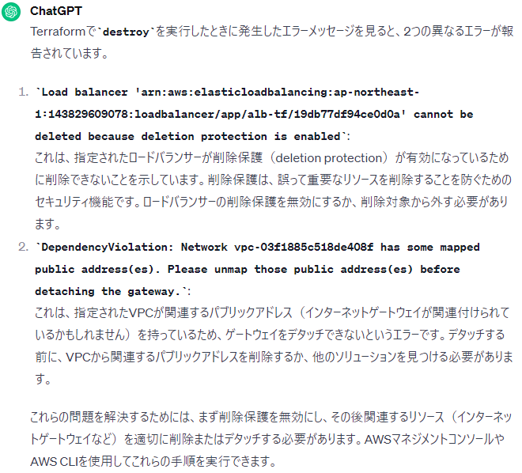

# terraform destroyできなかった話
* 一通りリソースが作れたこと確認したので、お金もかかるし消そうと、`terraform destroy`コマンド叩いたところ、リソースがなかなか消えなかった話をメモします。
* 今回はわかりやすいとこところでは、RDS、VPC、IGW（InternernetGateWay）、ALBが残っていました。
* わかりにくいところで、S3、セキュリティグループ
## なかなか消えない状態とは
* RDS(2m40s) 

* ALB 

  * 赤線のところは、最後まで消えず、エラー返されたときにハッとなりました。。
  * そして実はALBに適用したセキュリティグループも消えずに残っていました。
* IGW(14m10s)＋エラーメッセージ 

## エラーメッセージ
以下の内容でした。（ChatGPT） 

## 原因調査
* 調べると消えない系の事象は、理解したものではだいたいが以下の理由に落ち着きそうです。
  * A)リソース自体に削除保護がかかっているタイプ
    * RDSでインスタンス削除時にスナップショットを取得する設定をOnにしている
      * 今回は`skip_final_snapshot = true`としていたのでdestroyできましたが、本番利用時はtrueがいいと思います
    * ロードバランサーで削除保護をOnにしている
      * 今回は`enable_deletion_protection = true`とバッチリ書いていましたので、そりゃ削除できないはず
    * `deletion protection`系のパラメータが`true`になっていることが主な理由そうです。そして.tfファイルに明示的に記述していない場合、デフォルトでOnになっていたりします。ただやはり本番利用時は誤って消してしまわないように削除保護系はOnにしておくほうがいいと思います。
    * S3はバケットの中身を空にしないとバケット自体を消せない
  * B)リソース間で依存関係があり、解除しないと消せないタイプ
    * インターネットゲートウェイがVPCと依存関係にありデタッチしないと消せない
    * セキュリティグループで囲っている（を適用している）リソースが残っている場合、このSGは消せない∵いわゆるファイアウォールを外している状態になるからだと思います。
  * C)体験していないこと
    * 参考記事）[Terraform destroyできなくて困ったとき](https://qiita.com/ezaqiita/items/46811b5e4bf3ff5398ca)

## 実態確認
マネジメントコンソール上は以下の状態でした 
* ALB
 

* IGW

* SG

## 解消策
原因が分かったので、削除自体はマネジメントコンソールでやってしまったのですが、他の方法もあると思い、調べたことをメモします。
#### 1. tfファイルのコードを修正して（protectionをオフにするなど）、applyした後にdestroy
* この方法はできなくはないと思いますが、単純に`terraform apply`だけだと、他のリソースもまた復活してしまいますし、時間もかかります。
* リソースを絞って`$ terraform apply -target="module.aws-modules.aws_lb.alb_tf"`する方法もありますが、リソースの記述の中にはすでに消してしまったリソースからの引用記述も含まれているので、おそらくapplyしたときに依存関係を保てずにエラーを返されると思います。
* 以上から1の方法で削除するのはやめました
#### 2. AWS CLIからコマンドで原因箇所を設定変更してそのまま削除またはdestroy
これができると一番インフラエンジニアっぽいと思います。
* ピンポイントで「IGWをVPCからデタッチ」、「S3バケット内を空にする」など、AWS CLIはできることがいろいろあります。
* 例）S3バケット空にする→`aws s3 rm s3://bucket-name/doc --recursive`
* 参考記事）
  * （公式）
    * https://docs.aws.amazon.com/ja_jp/AmazonS3/latest/userguide/empty-bucket.html
    * https://docs.aws.amazon.com/ja_jp/vpc/latest/userguide/delete-vpc.html
    * https://repost.aws/ja/knowledge-center/troubleshoot-dependency-error-delete-vpc
  * https://qiita.com/tcsh/items/81006ffe436df3b584ea

## まとめ
* infrastructureは作るときはさくっとできてしまいますが、後始末はIaC感が薄れます
* ただ、解消策2の方法はコマンドをたたくことになるので、ある程度シェルスクリプトを用意しておくことで対応できるかもしれません。
* シェルスクリプトで対応する場合は、protectionのオフや依存関係のデタッチ系のスクリプトの後にterraform destroyコマンドをたたくシナリオがいいかなと思いました。
